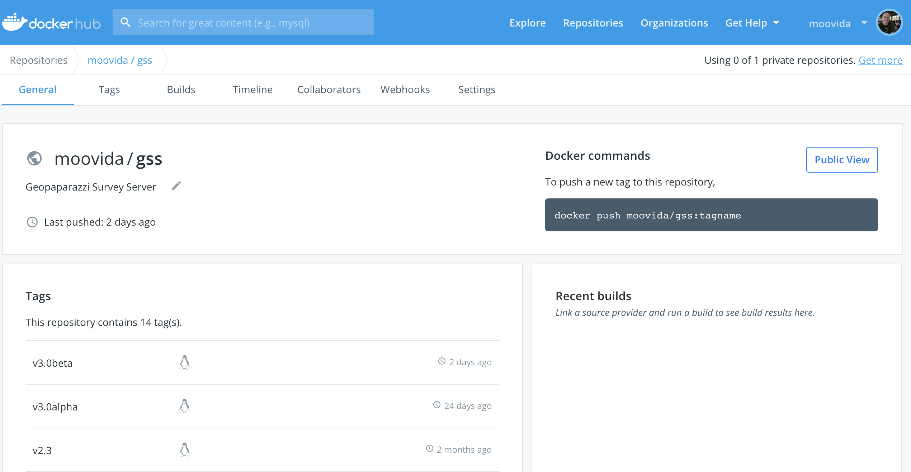
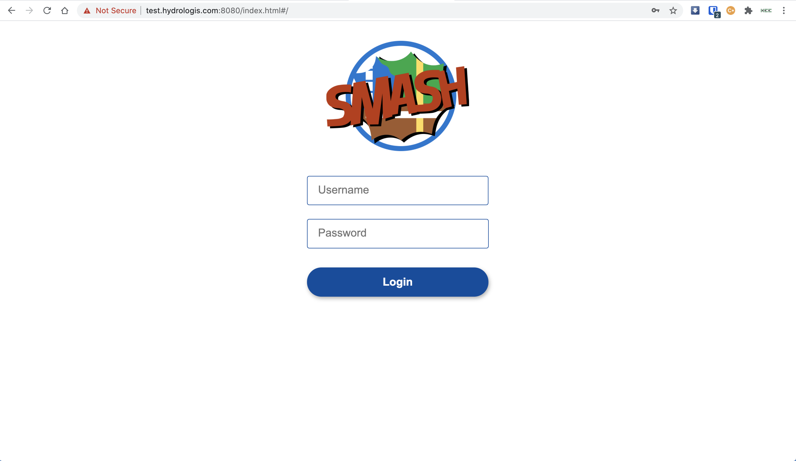
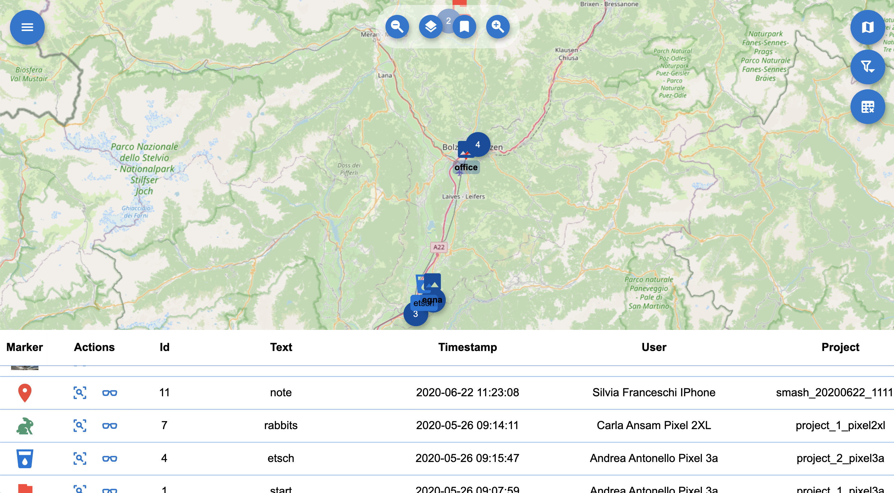

= The Geopaparazzi Survey Server
HydroloGIS S.r.l.
2020-04-01
:gss_version: 2.2
:tomcat_version: 9.0.13
:doctype: article
:description: A description
:encoding: utf-8
:lang: en
:toc: left
:toclevels: 4
:numbered:
:experimental:
:reproducible:
:icons: font
:listing-caption: Listing
:sectnums:
:mdash: &#8212;
:language: asciidoc
ifdef::backend-pdf[]
:title-logo-image: image:logo.png[align=center]
:source-highlighter: rouge
//:rouge-style: github
//:source-highlighter: pygments
//:pygments-style: tango
endif::[]
:stem:

<<<

== The Geopaparazzi Survey Server & Friends

image::logo.png[scaledwidth=30%, width=30%, align="center"]

The Geopaparazzi Survey Server (GSS) is a web application that allows http://www.geopaparazzi.eu[geopaparazzi]
users to synchronize their project data with a central server.

Its companion is an Android app named **Geopaparazzi Survey Server Sync** (GSSS) 
https://play.google.com/store/apps/details?id=com.hydrologis.gssmobile[available on google play].
The app can connect to geopaparazzi projects and synchronize the data contained using the unique device ID to
upload the data to the server.

A device, to be able to connect to the server, needs to be registered in the surveyor settings section of the server by an administrator user.

The applications are available as Free and Open Source software. The server is available under EPL v2.0, while the 
mobile app is available under GPL v3.0.

== The server

=== Preparing the data folder

To run GSS you can prepare the data folder for the server, which will contain 
the database (if it doesn't exist, it is created from scratch), some styling 
components and optional mapsforge *.map files for local tiles generation.

NOTE: You can just start with an empty folder, which will be filled with the bare minimum necessary 
to run GSS.

Let's assume you are a heavy lifter and want to do things on your own, and that the data folder 
is named TESTGSS, then the folder structure needs contain at least the following:

----
TESTGSS/
|-- DATA    <-- folder
|   |-- images.png
|   `-- notes.png
`-- WORKSPACE    <-- folder
----

Where **images.png** and **notes.png** are the images that will be used in the map view to style
geopaparazzi notes and media notes.


=== Installation

==== Installation with docker (linux)

The GSS server available as docker image from the https://hub.docker.com/r/moovida/gss/[docker hub]. As such
it works best on linux systems that have docker installed. 

Installing docker is resumed in the following steps on ubuntu and similar systems:


[source,bash]
----
curl -fsSL https://download.docker.com/linux/ubuntu/gpg | sudo apt-key add -
sudo add-apt-repository "deb [arch=amd64] https://download.docker.com/linux/ubuntu $(lsb_release -cs) stable"
sudo apt-get update
sudo apt install docker.io
sudo systemctl start docker
sudo systemctl enable docker
docker --version
sudo usermod -a -G docker $USER
----

You can test the installation running the hello world application:

[source,bash]
----
docker run hello-world
----

If it works you are ready to get the GSS from the docker hub.

.GSS on hub.docker.com.


To install the docker image just open a terminal and type in from shell:

[source,bash,subs="attributes+"]
----
docker pull moovida/gss:v{gss_version}
----

This will download the server image and install it on your machine.

The installation process should reveal something similar to the following (the version number will most probably be different):

.GSS installation process.
image::images/02_install.png[scaledwidth=70%, width=70%, align="center"]


[NOTE]
====
And once finished, the image should be visible with the command:
[source,bash]
----
docker images
----
====

==== Installation with Tomcat (windows)

The docker installation takes a lot of space (around 1Gb at the time of writing). Moreover
docker might be a bit tricky to get running properly on windows. Therefore we provide 
an alternative installation the good old java way: through tomcat.

The installation process in this case will be done on windows.

To install tomcat on windows and tweak it to be used with GSS:

* Download tomcat 9. At the time of writing the latest version is https://www-eu.apache.org/dist/tomcat/tomcat-9/v9.0.13/bin/apache-tomcat-9.0.13-windows-x64.zip[{tomcat_version}]. Unzio the archive to your disk.
* enter the folder **apache-tomcat-{tomcat_version}/conf/** and add to the file **server.xml** the attribute ```URIEncoding="UTF-8”``` to the line that contains ```<Connector port="8080" protocol=…```
* to have access to the admin gui, in the same conf folder add a user to `tomcat-users.xml`. For example: 

    <role rolename="manager-gui"/>
    <user username="tomcat" password="qweasdzxcpoilkjmnb123098" roles="manager-gui"/>

* set the neccessary environmental variables in file `apache-tomcat-{tomcat_version}/bin/setenv.bat`.
    
    set JAVA_OPTS=-Xms1256m -Xmx4g -Dstage.globalfolder=/path_to/TESTGSS/

* copy the file of the Geopaparazzi Survey Server (currently gss-{gss_version}.war) into the folder webapps and rename it as ROOT.war


=== Run the server

==== Run the server with docker

To run the GSS server, it is necessary to define a few things:

* the path to the data folder
* the port that needs to be used
* the docker image to use

Assuming we want to run the application on the data folder defined before and on port 8080,
the command to run the application is:

[source,bash,subs="attributes+"]
----
docker run -v /media/hydrologis/Samsung_T3/TESTGSS:/home/basefolder -e JAVA_OPTS="-Xms1256m -Xmx4g -Dstage.globalfolder=/home/basefolder/" -p 8080:8080 moovida/gss:v{gss_version}
----

Open your favorite browser and enter the url:

----
http://localhost:8080
----

You should get the following login screen:


.The GSS login screen.


This already means that you are ready to rumble!

You can login with:

* user: god
* password: god

Which already tells us that the user has quite some admin rights.

Once logged in, the dashboard view is shown.

=== GSS Views

The GSS views are organized as follows:

The upper toolbar features the menu button on the left, through which the side toolbar can be hidden. At the very right
of the toolbar the currently logged user is shown.

The left toolbar contains buttons to access the available views:

* Dashboard
* Map View
* Settings
  - Surveyors (admin mode)
  - Web Users (admin mode)
  - Map Chooser
* Export
  - PDF
  - KMZ
  - Database (admin mode)
* Project Data (admin mode)
* Form Builder
* Log View (admin mode)
* About
* Logout


==== The dashboard

The dashboard view shows a simple chart listing the amount of information for each device.

If no data are available, as in our inizial case, the folloing will be shown:

.The empty dashboard.
image::images/04_dashboard.png[scaledwidth=100%, width=100%, align="center"]

If instead data are available, the dashboard will give some information about the work in progress:

.The dashboard.
image::images/04_dashboard2.png[scaledwidth=100%, width=100%, align="center"]


==== The mapview

The mapview features the Surveyor list and a map panel.

The surveyor can be actived by selecting the checkbox in the table. Once the data of the 
surveyor are loaded, through the zoom button on top of the table it is possible to zoom to 
the surveyor's data extent.

.The mapview with the surveyors list.


If data are uploaded while on the map view, one can either reload the view by refreshing the page
or:

* using the first button to reload the data of the currently loaded surveyor
* using the last button to reload all the available surveyors


The data can be queried by clicking on them. Simple information is shown as described below.

In the case of notes, the main note text, the elevation and the timestamp are shown. Note that 
for notes that have forms, the complex form is not visualized in the information box.

.Notes.
image::images/08_notes.png[scaledwidth=25%, width=25%, align="center"]

For GPS logs the name of the log and the start and end timestamp are shown.

.Gps Logs.
image::images/09_logs.png[scaledwidth=30%, width=30%, align="center"]

For media notes it is possible to visualize the images, by clicking on the image icon.

.Media notes.
image::images/10_media.png[scaledwidth=70%, width=70%, align="center"]

==== The Settings Views

Selecting the proper action from the settings menu it is possible to:

* Configure surveyors. Surveyors can be added or removed. Note that only 
  surveyors registered are able to connect with the mobile app.
  Editable attributes can be changed by double-clicking on the surveyor. 
  **Warning: removing a surveyor will also delete all its data.**

.Surveyor configuration.
image::images/12_surveyors.png[scaledwidth=100%, width=100%, align="center"]

* Create web users and groups. There are two levels of users: admins and normal users.
  
.Web users configuration.
image::images/11_users.png[scaledwidth=100%, width=100%, align="center"]

* Configure background maps. Several map services can be added to the background 
  maps that can then be selected in the mapview. 

.The background maps configuration.
image::images/13_maps.png[scaledwidth=100%, width=100%, align="center"]

WARNING: Many of the available map services need a license key to be accessed 
and/or have particular requirements to be used. Make sure that you have the 
rights to use the maps you select.

==== The Export Views

Selecting the proper action from the export menu it is possible to:

* Export the data of one or more surveyors as PDF:

.The PDF export view
image::images/14_export_pdf.png[scaledwidth=100%, width=100%, align="center"]

* Export the data of one or more surveyors as KMZ:
  
.The KMZ export view
image::images/15_export_kmz.png[scaledwidth=100%, width=100%, align="center"]

* Export the current database. While it is best to connect to the online database through the port 9092, which is exposed, 
  in some environments it might not be possible (ex. Heroku allows only one port). In this
  case it is possible to export the database by downloading it.

.The database export view
image::images/15_1_export_db.png[scaledwidth=100%, width=100%, align="center"]

==== The Project Data View

In the project data view it is possible to upload datasets that can be downloaded by the mobiles app to 
allow geopaparazzi to access them.

The view is split into 3 columns, one for each supported datatype: 

* basemaps (mbtiles, mapsforge maps)
* overlays (spatialite databases)
* projects (geopaparazzi projects)

The user can simply drag the files in the lower area to upload the files.

.The project data view
image::images/23_dataview_drag.png[scaledwidth=100%, width=100%, align="center"]

File types are placed in the right tables if recongized:

.The different datatype tables
image::images/24_dataview.png[scaledwidth=100%, width=100%, align="center"]


==== The Form Builder View

The form view is an interactive gui builder for geopaparazzi forms.

To better understand the description of its usage, some naming needs to be fixed:

* **tags**: a tag is what we see as a complete file on geopaparazzi (speak tags.json). From 
  version 5.6.2 on Geopaparazzi loads any file that ends with **tags.json** from the geopaparazzi folder,
  allowing tags to be kept separate.
* **section**: a section is what in geopaparazzi is seen as a button in the *add notes* view.
* **form**: a form is a tab of the geopaparazzi view
* **widget**: it is the widget the user interacts with, ex. combobox or textfield

The naming is a bit confusing, but comes form the early days and is in the source code of geopaparazzi. So, in order 
to be able to always document things the same way, we have to follow these naming.

.The From Builder
image::images/25_forms.png[scaledwidth=100%, width=100%, align="center"]

After creating a tag with the **add** button, one can add a new section to the tag:

.The add section dialog.
image::images/26_forms.png[scaledwidth=100%, width=100%, align="center"]

Once the section is created the user can add **forms** to the section, which will load
tabs for each one in the tab view.

To each of it widgets can be added:

.The add widget menu while adding a widget to a form tab.
image::images/27_forms.png[scaledwidth=100%, width=100%, align="center"]

The add widget dialogs prompt the user for a key and a label and other parameters depending on the type:

.The add text field widget
image::images/28_forms.png[scaledwidth=100%, width=100%, align="center"]

.The add combo widget, which can load from a textfile the combobox entries.
image::images/29_forms.png[scaledwidth=100%, width=100%, align="center"]

.The work in progress form view.
image::images/30_forms.png[scaledwidth=100%, width=100%, align="center"]

Once the user has finalized his tag entry, it is necessary to mark it visible in order for the mobile app to see it:

.The checkbox to mark the tag visible.
image::images/31_forms.png[scaledwidth=70%, width=70%, align="center"]


== The mobile app

http://www.geopaparazzi.org/smash/index.html[SMASH] is the suggested app to synchronize data with the 
survey server. It allows both download of datasets as well as incremental uploading of 
surveyed data. Have a look at the http://www.geopaparazzi.org/smash/index.html#_gss[SMASH manual to see hot to import or export data].


