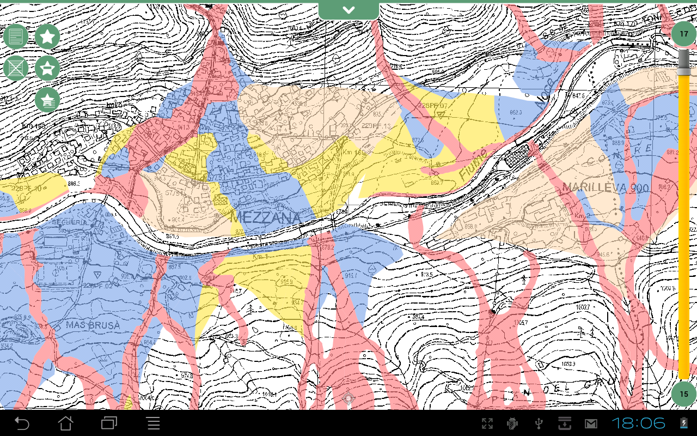

Introduction
============

What is Geopaparazzi?
--------------------------

Geopaparazzi is a tool developed to do very fast qualitative engineering/geologic surveys. Even if the main aim is in the field of surveying, it contains tools that can be of great use also to OpenStreetMappers as well as tourists that want to keep a geo-diary. Geopaparazzi is now available on the Android Market. Search for geopaparazzi on your phone or get it from the [*]_.

.. [*] online android market http://market.android.com/details?id=eu.hydrologis.geopaparazzi

The main aim of Geopaparazzi is to have a tool that:

 * fits in any pocket and can be always at hand, when needed
 * gives the possibility to take georeferenced and possibly orientated pictures during the survey, with further possibility to import them into the main GIS application BeeGIS
 * is able to exploit easily internet connection, if available.
 * is extremely easy to use and intuitive, providing just few important functionalities.

The main features available in Geopaparazzi are:

 * georeferenced notes
 * georeferenced and orientated pictures
 * gps tracks logging
 * easy export of collected data
 * a map view for the navigation of the environment

