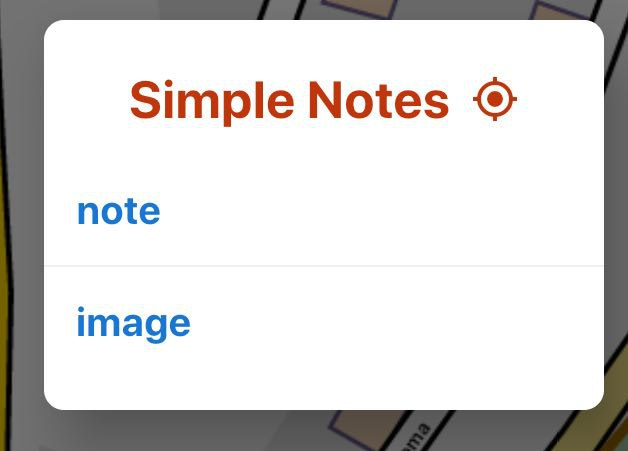
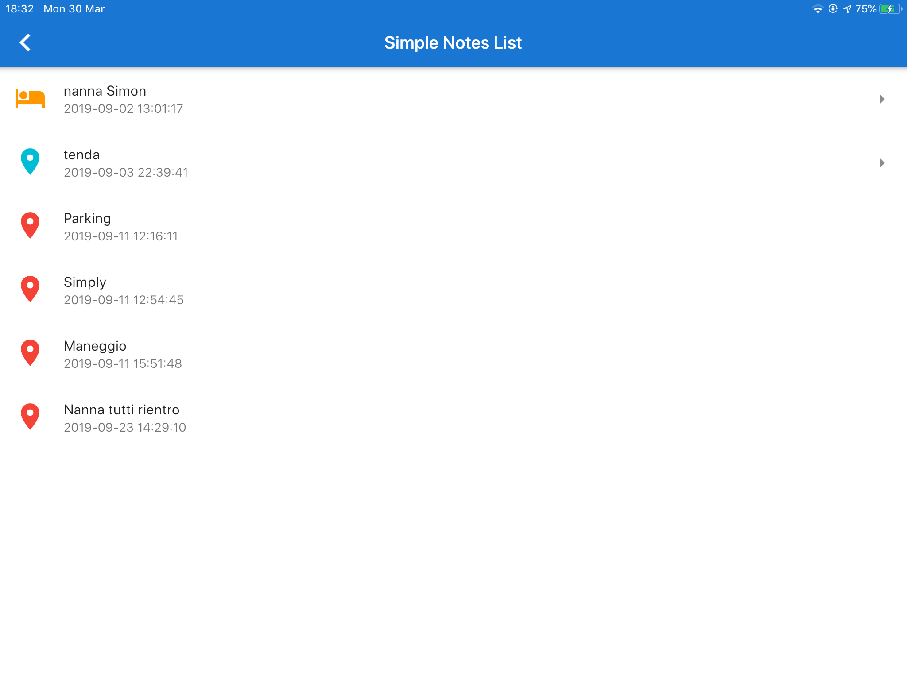
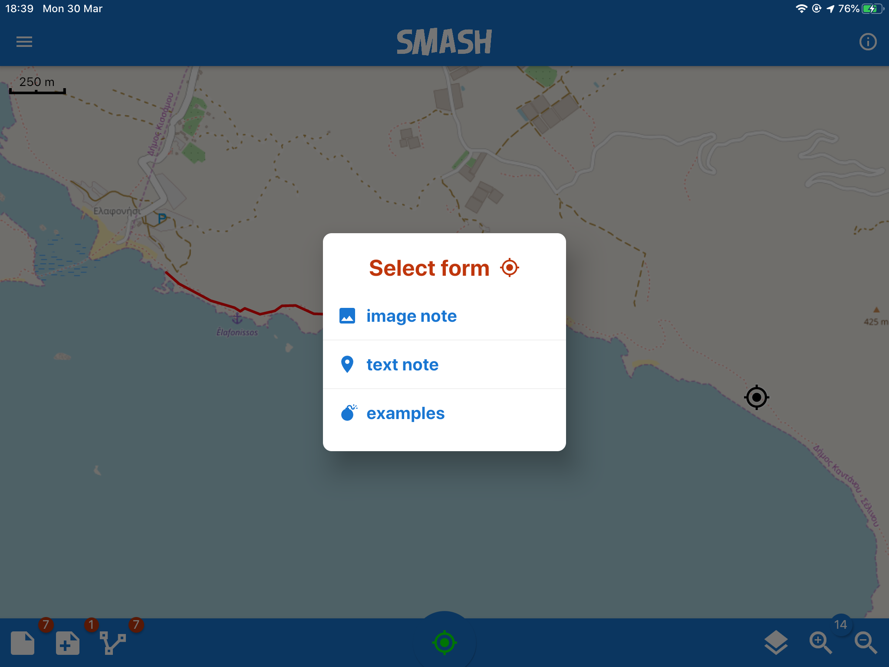

== The Main View

Once you launch SMASH, the main view appears. 

All the features that need to be quickly accessed, such as toggling GPS on and off, 
creating a note, as well as visualizing the current position 
on a map, are accessible from that view.

[.text-center]
====
image::smash/ipad/main_view.PNG[scaledwidth=50%, width=50%, align="center"]
The main view of SMASH.
====

From the main view the following primary functions can be accessed:

* open the GPS info tools
* take notes and open notes list (for simple notes and form notes)
* create a GPS log and open the logs list
* open the layer view
* open the project information and share dialog
* open the left side drawer with the main menu
* open the left side drawer with the tools section

=== GPS info button and tools
anchor:gps_info_tools[]

The central bottom button is the GPS info button. 

The icon of the GPS status button can be of the following colors:

* RED:  GPS is not switched on
* ORANGE: GPS is on but no fix was acquired
* GREEN: GPS is on and has fix, but no log is being recorded
* BLUE: GPS is logging.

By tapping on the button, if the GPS has a fix, the map is centered on the GPS position.

By long tapping on the button, the GPS info and tools are opened:

[.text-center]
====
image::smash/ipad/gps_tools_center_on.PNG[scaledwidth=50%, width=50%, align="center"]
The GPS info and tools.
====

From here the user can access the current GPS information and copy the coorinates into the device's clipboard. It is also possible to enable centering the map on the GPS position.

=== Notes

SMASH supports different types of notes:

* simple notes
  - simple text notes
  - simple picture notes
* form-based notes

==== Simple Notes

To create simple notes tap on the first icon of the lower toolbar. The *Simple Notes* dialog appears, allowing to choose between text or image notes:

[.text-center]
====
image::smash/ipad/notes_add.jpeg[scaledwidth=50%, width=50%]
Adding simple notes to the project. The note will be placed in the map center.
====

The icon at the right of the dialog title tells the user whether the note will be inserted in the current GPS position or in the current map center.

[.text-center]
====

Adding simple notes to the project. The note will be placed in the current GPS position.
====

The decision between GPS position and map center can be toggled from the right side drawer.

When the **text note** entry is selected, the note properties view opens:

[.text-center]
====
image::smash/ipad/notes_properties.PNG[scaledwidth=50%, width=50%]
The notes properties view.
====

By double tapping on the first table entry, it is possible to enter the text of the note.

Moreover it is possible to select color, size and icon for the note.

When the **image note** is used instead, the camera opens and allows the user to save a picture to the project.

If a note is tapped on from the map view, a snackbar opens, allowing to share, delete or edit the selected note:

[.text-center]
====
image::smash/ipad/notes_snackbar.jpeg[scaledwidth=50%, width=50%]
The quick note info snackbar.
====

If the note is an image note, a thumbnail of the note is shown.

==== Simple Notes List

By long tapping on the _add note_ button, the notes list opens:

[.text-center]
====

The notes list view.
====

From here notes can be modified or deleted (swipe note to the left).

==== Form based notes

The second icon from left on the lower toolbar is for form based notes.

[.text-center]
====

The add form note dialog.
====

Form based notes allow you to take complex notes containing detailed information.
Some example forms are included in the installation of SMASH.

The **examples** entry in particular shows all the possible form widgets available:

[.text-center]
====
image::smash/ipad/form_text.PNG[scaledwidth=50%, width=50%]
An example of form based notes.
====

The notes can be saved and modified at any time.

To understand how to create forms, have a look at the https://www.geopaparazzi.org/v600/index.html#_using_form_based_notes[dedicated section in the geopaparazzi project]. The two projects share the exact same project and form format.

==== Form based notes

Same as for simple notes, when long tapping on the button, the user is led to the list of fomr notes. 

==== GPS Logging

To start logging, the user simply has to push the **GPS log** button.

Once it is tapped, the user is prompted to insert a name for the 
log or to accept the one generated based on the current date and time
( log_YYYYMMDD_HHMMSS ).

[.text-center]
====
image::smash/ipad/log_start.jpeg[scaledwidth=50%, width=50%]
The new GPS log dialog.
====

Once logging has started, the GPS logging button will turn orange and the GPS status icon blue.
 
[.text-center]
====
image::smash/ipad/log_button_on.jpeg[scaledwidth=60%, width=60%]
The GPS logging button with its blue (currently logging) color.
====

To stop logging, the same button is used. Once tapped, you are prompted 
to verify the action. 

==== Project Info

The Project Info screen shows information about your current SMASH project database.

It shows:

* the database file name
* the project name
* the project description
* project notes
* creation and last closing dates
* the user that created the project
* the user that last modified the project

Apart from the dates, that are set by the system, all data can be changed and 
saved through the save button.

.The Project Info screen.
image::02_dashboard/07_project_info.png[scaledwidth=30%, width=30%]

It is also possible to add additional metadata to the project information. The plus button at the right side of the actionbar opens an input dialog that allows the user to define a key, a label and a value for the new metadata entry:

.The new metadata entry dialog.
image::02_dashboard/07_project_info_plus.png[scaledwidth=30%, width=30%]

==== Map View
 
.The map view.
image::02_dashboard/12_map_view.png[scaledwidth=30%, width=30%]

The Map View presents a map and a set of tools that can be used to navigate 
the map, make measurements, or edit datasets. The various tools are described 
in the section dedicated to the <<Map View>>.

==== Import

.The import view.
image::02_dashboard/13_import.png[scaledwidth=30%, width=30%]

SMASH supports the import of:

* GPX datasets
* bookmarks
* default Spatialite database
* SMASH cloud projects
* SMASH Cloud Profiles

===== GPX

By tapping on the *GPX* icon, a simple file browser is shown to import your GPX file.

.The simple SMASH file browser.
image::02_dashboard/16_import_gpx.png[scaledwidth=30%, width=30%]

The browser only shows folders and files with gpx extensions. On selection, the 
file is imported into the current project.

===== Bookmarks

Bookmarks can be imported from csv files that *must be placed in the root of the sdcard* and the name of which has to start with the part **bookmarks** and to end with the extension **.csv**.

SMASH will let you select the files to import if more than one are available import only those that do not exist already.

The format of the csv is: **NAME, LATITUDE, LONGITUDE** as for example:

----------------------------------------------
Uscita Vicenza Est, 45.514237, 11.593432
Le Bistrot, 46.070037, 11.220296
Ciolda, 46.024756, 11.230184
Hotel Trieste, 45.642043,13.780791
Grassday Trieste,45.65844,13.79320
----------------------------------------------

===== Default databases

When tapping the default database import button, you are asked to name the new Spatialite 
database to create, with the default name based on the current date and time:

.Creating A Default Spatialite Database
image::02_dashboard/19_mapsforge.png[scaledwidth=30%, width=30%]

The newly created database is **editing ready** and contains a layer of each type geometry type (points, lines, polygon). Since it is a template db, the attributes table have been created as generic fields with names from **field1 to field20**. It is very generic and simple, but still of use when you have to quickly draw some spatial data with attributes and have no database prepared.

===== Cloud Projects
SMASH Project files can be downloaded from a SMASH Project server.  To enable the import of projects from the Cloud, make sure you enter the settings in the <<Cloud Projects Sync Settings, Cloud Projects Sync Settings>>

===== Cloud Profiles
Profiles are a convenient way to group map layers, note forms, a project file, and other files.  SMASH Cloud Profiles must be downloaded from a SMASH Profile server (standard local <<Profiles, Profiles>> can be created on your device using the Profiles screen rom the main menu).  To enable the import of Profiles from the Cloud, make sure you enter the settings in the <<Cloud server Settings, Cloud server Settings>>.  

Once your Cloud server Settings are set, and you press the Cloud Profiles button on the Import view, the server will send a list of Profiles available for download.

.Cloud Profiles List
image::02_dashboard/22_import_profiles1.png[scaledwidth=30%, width=30%]

image::02_dashboard/package_download.png[float="left"]
Select a Profile for download by pressing on the icon of the Profile.  This will start the download of the Profile and the files associated with the Profile.  The download may take some time depending on the size of the files.

When the download is completed, you can activate the Profile by using the Profile view from the Main View menu, selecting the <<Adding data to a Profile, Profile Info>> tab, and sliding the Activate profile switch.

==== Export

.The export view.
image::02_dashboard/18_export.png[scaledwidth=30%, width=30%]

SMASH supports the export to the following formats:

* KMZ
* GPX
* bookmarks
* images
* Project Forms to PDF
* SMASH cloud projects
* SMASH cloud profiles

===== KMZ

It is possible to export all collected data to KMZ format. 

KMZ is well known as it can be visualized in the 3D viewer http://earth.google.com/[Google Earth].

In the export:

* the notes are placed as red pins having the first letters of the text content as label
* the images are placed as yellow pins
* the GPS logs are visualized as tracks

===== GPX

The lines and notes data are exported to GPX, creating tracks and waypoints.

===== Bookmarks

Bookmarks can be exported to a csv file that has to be called *bookmarks.csv* and 
are placed in the root of the sdcard.

SMASH will write to the file only those bookmarks that do not exist already in the csv. 

===== Images

Since images are kept inside the database, this export is handy if the user needs 
to use the images inside a different software. In this case all the images of the project are exported inside a folder and a popup message shows the folder path.

===== Project Forms to PDF

You can export your notes to a simple PDF document.  After pressing the "Project Forms to PDF" button you can select which notes you would like to include in the PDF file.  The PDF file created will be a the root of the device's file system and named "SMASH_projectexport_" with a timestamp and a .pdf extension in the file name.

===== Cloud Projects
SMASH Project files can be uploaded to a SMASH Project server.  To enable the upload of projects to the Cloud, make sure you enter the settings in the <<Cloud Projects Sync Settings, Cloud Projects Sync Settings>>.

===== Cloud Profiles
SMASH Profile files (project and spatialite files) can be uploaded to a SMASH Profile server.  To enable the upload of profiles to the Cloud, make sure you enter the settings in the <<Cloud Projects Sync Settings, Cloud Projects Sync Settings>>.

