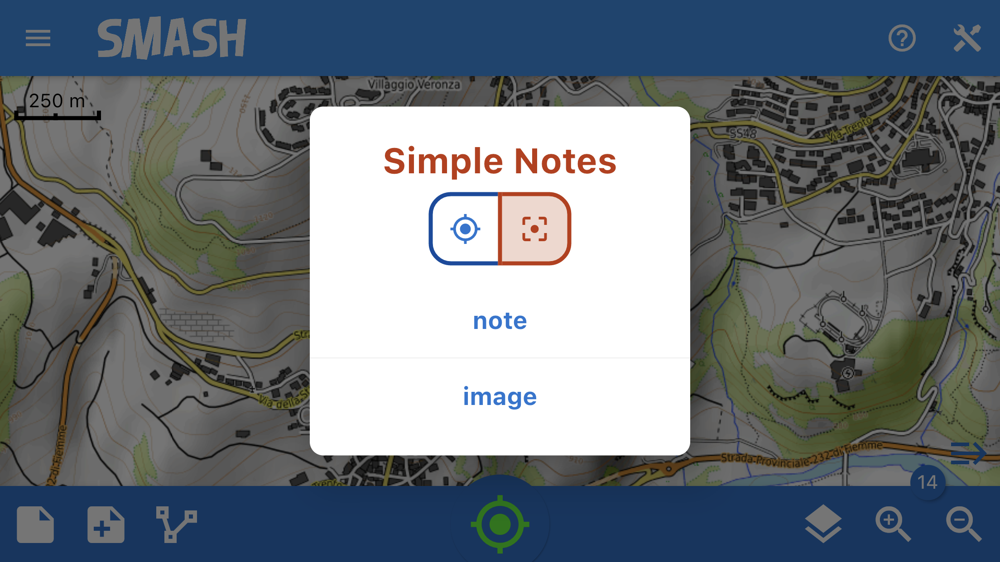
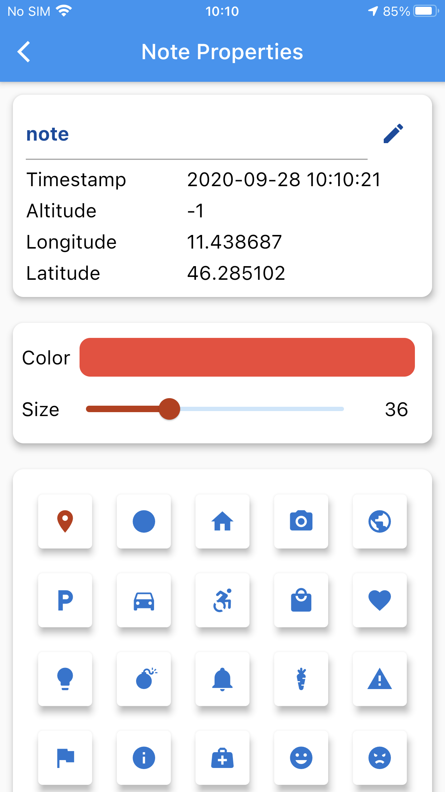
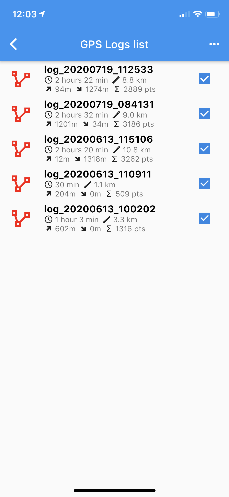
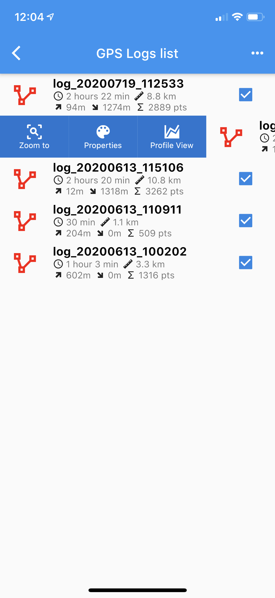
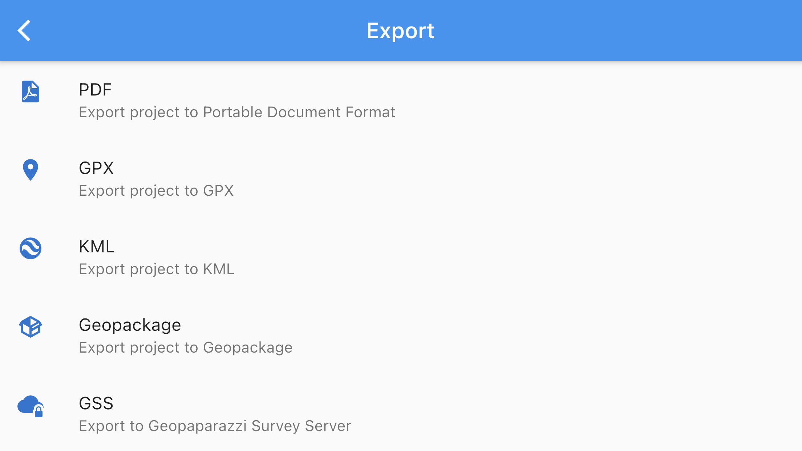
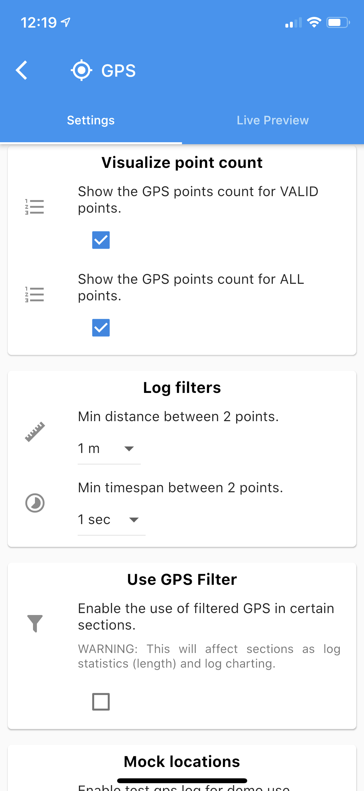
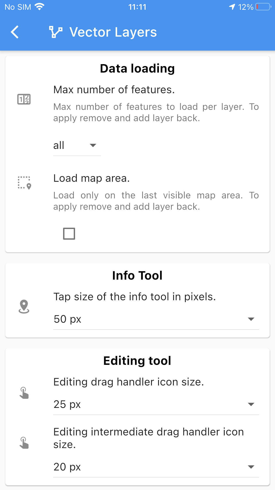

== The startup

Once you launch SMASH, the application asks for the possibility to create a new project or open an already existing one. Select the project from your device or define the name of a new one (default name is an option).

[.text-center]
====

The selection of the working project at startup.
====

NOTE:: SMASH is based on the concept of projects: all the data
collected for a project are saved in the same project
database file (GPS log, simple notes, images, form notes).

== The Main View

After selecting the project, the main view appears. 

All the features that need to be quickly accessed, such as logging GPS, 
creating a note, as well as visualizing the current position on a map, are accessible from that view.

[.text-center]
====

The main view of SMASH.
====

In particular, from the main view the following primary functions can be accessed:

* center map on GPS, open the GPS info tools and activate the automatic center on GPS
* take notes, open notes list and select the view mode (for simple notes and form notes)
* create a GPS log and open the logs list
* open the layer view and open the map plugins dialog
* open the project information and share dialog
* open the left side drawer with the main menu
* open the right side drawer with the tools section
* open the interactive coach marks

=== GPS info button and tools
anchor:gps_info_tools[]

The central bottom button is the GPS info button. 

The icon of the GPS status button can be of the following colors:

* RED: GPS is switched off, _this option is available only on iOS devices_
* ORANGE: GPS is on but no fix was acquired
* GREEN: GPS is on and has fix, but no log is being recorded
* BLUE: GPS is on and logging.

By tapping on the button, if the GPS has a fix, the map is centered on the GPS position.

By long tapping on the button, the GPS info and tools are opened:

[.text-center]
====

The GPS info and tools.
====

From here the user can access the current GPS information and copy the coorinates into the device's clipboard. To do that long tap on the coordinate you want to copy.

[.text-center]
====

The GPS info and tools copy coordinates.
====

To close the GPS info and tools panel just swipe it down. 

=== Notes

SMASH supports different types of notes:

* simple notes
  - simple text notes
  - simple picture notes
* form-based notes

==== Simple Notes

To create simple notes tap on the first icon of the lower toolbar. The *Simple Notes* dialog appears, allowing to choose between:

* text or image notes
* to place the note in the current GPS position or in Map Center.

[.text-center]
====

Adding simple notes to the project. The note will be placed in the GPS position.
====

The highlighted icon at the top of the dialog tells the user whether the note will be inserted in the current GPS position or in the current map center.

[.text-center]
====

Adding simple notes to the project. The note will be placed in the current GPS position.
====

When the **text note** entry is selected, the note properties view opens:

[.text-center]
====

The text properties view.
====

By tapping on the pencil right to the first table entry, it is possible to enter the text of the note.

Moreover it is possible to select color, size and icon for the note.

When the **image note** is used instead, the camera opens and allows the user to save a picture to the project.

If a note is tapped on from the map view, a snackbar opens, allowing to share, delete or edit the selected note:

[.text-center]
====

The quick note info snackbar.
====

If the note is an image note, a thumbnail of the note is shown.

==== Simple Notes List

By long tapping on the _add note_ button, the notes list opens:

[.text-center]
====
image::images/ipad/notes_list.PNG[scaledwidth=50%, width=50%]
The notes list view.
====

From here notes can be modified or zoom to the selected note (swipe note to the right) or deleted (swipe note to the left).

[.text-center]
====

The options available for a single note in the notes list.
====

==== Simple Notes visualization

By tapping twice on the _add note_ button, the settings for the notes view mode opens:

[.text-center]
====

The notes list view.
====

From here you can decide what to visualize for that kind of note (icon, label or nothing).

==== Form based notes
anchor:form_notes[]

The second icon from left on the lower toolbar is for form based notes.

[.text-center]
====

The add form note dialog. Icons are supported.
====

Form based notes allow you to take complex notes containing detailed information.
Some example forms are included in the installation of SMASH.

The **examples** entry in particular shows all the possible form widgets available:

[.text-center]
====

An example of form based notes.
====

The notes can be saved and modified at any time.

To understand how to create forms, have a look at the https://www.geopaparazzi.org/v600/index.html#_using_form_based_notes[dedicated section in the geopaparazzi project]. The two projects share the exact same project and form format.

There is only one thing in which SMASH And geopaparazzi forms differ and that is icons. SMASH supports icons in the single note definition but also in the definition of each widget.

To add an icon to the form definition, a tag **sectionicon** needs to be added to the section. This can be seen in the example forms, ex:

[source,json]
----
...
  {
    "sectionname": "text note",
    "sectiondescription": "a simple text note",
    "sectionicon": "fileAlt",
    "forms": [
      {
        "formname": "text note",
        "formitems": [
          {
            "key": "title",
            "value": "",
            "icon": "font",
            "islabel": "true",
            "type": "string",
            "mandatory": "no"
          },
          {
            "key": "description",
            "value": "",
            "icon": "infoCircle",
            "type": "string",
            "mandatory": "no"
          }
        ]
      }
    ]
  },
...
----

The same goes for **formitems**, that can feature an **icon** tag.

The icon name itself can be looked up in the <<icon section>> of SMASH.

==== Form Based Notes List

Same as for simple notes, when long tapping on the button, the user is led to the list of form notes. 

==== Form Based Notes visualization

Same as for simple notes, when tapping twice on the button, the settings for the notes view mode opens.

=== GPS Logging

To start logging, the user simply has to push the **GPS log** button.

Once it is tapped, the user is prompted to insert a name for the 
log or to accept the one generated based on the current date and time
(**log_YYYYMMDD_HHMMSS**).

[.text-center]
====

The new GPS log dialog.
====

Once logging has started, the GPS logging button will turn orange and the GPS status icon blue.
 
[.text-center]
====
image::images/ipad/log_button_on.jpeg[scaledwidth=60%, width=60%]
The GPS logging button with its blue (currently logging) color.
====

To stop logging, the same button is used. Once tapped, you are prompted 
to verify the action. 

==== GPS Logging List

Same as for the notes, when long tapping on the _GPS log_ button, the user is led to the list of GPS logs. 

[.text-center]
====

The GPS logging list view.
====

From here GPS logs can be zoom to or it is possible to modify the style of the selected GPS log (swipe log to the right) or deleted (swipe log to the left).

[.text-center]
====

The options available for a single GPS log in the GPS logs list.
====

==== GPS Logging visualization

Same as for the notes, when tapping twice on the _GPS log_ button, the settings for the GPS logs view mode opens.

[.text-center]
====

The options available to set the GPS logs view mode.
====

NOTE: SMASH uses a mathematical filter on GPS data to correct and homogenize the logs. In any case the application saves also the original data. The user can decide how to visualize the filtered and the original data (hide, solid, transparent).

=== The layers list view

The layers list view features the currently visible layers. Since layers on bottom cover layers above them in the map, there is the possibility to change the layers order simply by dragging the selected layer to the new position. The order defines the visualization of all the layers in the map (raster and vector, online and local).

[.text-center]
====

The layers list view.
====

From this view it is possible to add new layers from the <<maptypes, supported map types>> using the two icons on the top right of the current panel image:images/version_1_3_0/14_layers_list.jpeg[scaledwidth=10%, width=10%]: the first one to add an _online_ resource and the second one to add a _local_ resource.

If a layer features a bounding area (as vector maps or mbtiles layers), sliding it to the right will zoom the map on the bounding area. The right sliding also enables the possibility to set some visualization properties of the selected layer. 

Sliding the layer to the left, allows to remove the layer.

NOTE: Local data must have its own projection information file (_.prj_) both for rasters and for vectors. SMASH supports all the projections, some are loaded in the application by default. For those projection not yet supported just tap on the layer and follow the instructions. 

[.text-center]
====

The layers list shows a layer with a projection not supported.
====

[.text-center]
====

The list of supported projection after adding the new one.
====

NOTE: At the moment this operation shows some issues in rendering the layers list when the new definition of the projection has been added. To solve it try two times to add the projection and then activate and deactivate the layer in the layers list. This should update the visualization of the layer with the correct EPSG code.

[.text-center]
====

The list of supported projection after adding the new one.
====

=== Zoom buttons

The zoom buttons don't need lot of information. They can be used to zoom in and out the map. The same can be done using the pinch gestures.

== The tools drawer

The Tools or right Drawer button is placed on the right top action bar.

This menu groups some maps and features tools together with some extra actions.

[.text-center]
====

The complete tools drawer.
====

=== Project Info

It shows the path to the current database and allows the user to share the file with others.

[.text-center]
====

The project info panel with sharing button.
====

=== Position Tools

This section of the tools drawer contais the possibility to:

* _Go to_ a specified location entered by an address
* _Share position_ using other applications installed on the device
* enable the _Center on GPS_ functionality for the map visualization.

==== Go to

The go-to function allows to exploit the devices OS geocoding function to find locations based on an address. It is then possible to move the map to the selected result.

[.text-center]
====
image::images/ipad/geocoding.PNG[scaledwidth=70%, width=70%]
The geocoding view.
====

==== Share position

This action allows the user to share the current gps position with the most common social media methods available on the device.

=== Features tools

The **Query layers** checkbox can be used to enable the vector layer info and editing tool. Once enabled, tapping on the map will query the available vector layers for information in the tap position and editing of the selected features.

[.text-center]
====

The moment of tapping and loading query data with enabled vector queries.
====

The info tool queries all visible vector layers and opens the feature info view, which presents each selected feature highlighted in the map context and its attributes:

* to browse between the selecte features (if more than one) use the arrows on the top right of the window
* it is possible to edit the attributes of the feature of Geopackage layers by selecting the pencil near the value of the attribute in the table

[.text-center]
====
image::images/version_1_3_0/21_query_layers.jpeg[scaledwidth=70%, width=70%]
The feature info view showing a line feature.
====

[.text-center]
====

The feature info view showing a point feature.
====

=== Extras

This section contains some non specific tools of the application.

==== Available icons

This action opens the icons view:

[.text-center]
====
image::images/ipad/icons.PNG[scaledwidth=70%, width=70%]
The icons view.
====

In this view the user can select from all the icons of the https://materialdesignicons.com/[material design icons] project, which ones should appear in the notes properties view and therefore used as markers in the map.

The names that appear in the list can also be used to enable icons for form notes, as explained in the <<form_notes, forms section>>.

==== Offline maps

SMASH has a builtin function to download mapsforge (see <<maptypes, supported map types>>) map files for the whole world.

[.text-center]
====
image::images/ipad/offline_maps.PNG[scaledwidth=70%, width=70%]
The icons view.
====

Once a map is tapped, the download starts. This can take a while when downloading large countries. 

WARNING: At the current time, due to a tecnical issue in the flutter framework, the visualization of mapsforge maps at low zoomlevel leads to freezing of the user interface, since the tiles are generated in the main thread. Therefore, after the download, SMASH performs a one-time tile generation for low zoomlevels, freezing the user interface. It is suggested to let this process finish, in order to later experience a smooth map navigation using mapsforge maps.

== The main drawer

The left drawer contains some of the main operations that a user usually performs while not actively taking notes.

[.text-center]
====

The main, or left, drawer.
====

=== Project

When tapping on the **Project** action, the user is prompted to the starting panel (Project view) where it is possible to _Open and existing project_, _Create a new project_ or select one of the _Recent projects_:

* browse the local folders to select an existing project
* insert a new name for the project or accept the default one based on the timestamp
* select one of the most recent projects from the list

[.text-center]
====
image::images/ipad/project_new.jpeg[scaledwidth=70%, width=70%]
The main, or left, drawer.
====

New projects will be created inside the <<folderstructure,application's folder structure>>. To open old projects browse the project folder inside the local application's folder.

[.text-center]
====

The file browser view, showing the content of the _SMASH projects_ folder.
====

SMASH projects are of the exact same type as those of the https://www.geopaparazzi.org/geopaparazzi/index.html[geopaparazzi] project. That is the reason the extension of the file is **gpap**.

Once selected, the project is loaded.

=== Import

SMASH allows to import data from the https://www.geopaparazzi.org/gss/index.html[Geopaparazzi Survey Server].

[.text-center]
====
image::images/ipad/import.PNG[scaledwidth=70%, width=70%]
The import view.
====

In fact SMASH is currently the suggested tool to sync geopaparazzi and SMASH surveys with the GSS.

When entering the GSS import view, a list of datasets, projects and forms available from the server is presented to the user:

[.text-center]
====
image::images/ipad/gss_import.PNG[scaledwidth=70%, width=70%]
The gss import view.
====

Using the left icon data can be downloaded to the device. Once downloaded teh cion will show what datasets are already available.

=== Export

SMASH is currently able to export to PDF and to synchronize with the https://www.geopaparazzi.org/gss/index.html[Geopaparazzi Survey Server].

[.text-center]
====

The export view.
====

==== PDF

When pushing the pdf export button, a pdf is generated and saved to the export folder.

==== GSS

When pushing the GSS export button, the stats page is presented. It shows what will be uploaded to the server if pushing the **upload** button.

[.text-center]
====

The GSS export stats view.
====

Once the **upload** button is tapped, the upload begins. A list with the progress for each resource is presented:

[.text-center]
====
image::images/ipad/gss_upload.jpeg[scaledwidth=70%, width=70%]
The upload progress list.
====

If the device is not registered with the server, the following message will appear, stopping the upload:

[.text-center]
====
image::images/ipad/gss_upload_error.jpeg[scaledwidth=70%, width=70%]
The upload error in case of no permission to upload.
====

=== Settings

[.text-center]
====
image::images/ipad/settings.PNG[scaledwidth=70%, width=70%]
The settings view.
====

==== GPS Settings

[.text-center]
====

The gps settings view.
====

In the gps settings the user can define filters based on distance and time interval for the logging activity.

There is also the possibility to visualize the GPS point count separated for the _valid_ and for _all_ points.

Last but not least it is possible to simulate a gps log. The device needs to have a gps fix for this to work. This can be handy when in need to demo the application's logging functionality when sitting indoor, but still having a fix.

The second tab of the GPS setting view is dedicated to the _Live Preview_ of the GPS. It shows in details the different points fixed by the GPS with their main attributes and the influence of the different filters applied.

[.text-center]
====

The gps settings view.
====

==== Screen Settings

[.text-center]
====

The screen settings view.
====

In the screen settings view it is possible to:

* toggle the screen-always-on functionality
* use Retina the sceen mode
* style the map center cross
* change the size of the icons of the toolbar in the main view

==== Camera Settings

The camera settings allow to choose the pictures resolution between high, medium and low.

==== Vector Layers

[.text-center]
====

The vector layers settings view.
====

This settings part allows the user to:

* define the amount of data to be loaded. This can be important for large vector datasets that would make the map navigation less smooth; options are _all_ or a defined number of features from _50_ to _10000_
* select if to load the data only on the last visible map area
* define the radius of the tap of the info query tool.

==== Device Settings

[.text-center]
====

The device id view.
====

The device id can be necessary in various situations. This is the case of the synchronization with the https://www.geopaparazzi.org/gss/index.html[Geopaparazzi Survey Server]. In that case the device id is the unique identifier of a surveyor.

It is possible to override that device id for those cases in which a standardized id generation is used inside and organisation.

==== GSS Settings

[.text-center]
====

The gss setting view.
====

In this setting view the user can set the server url and the password on which there is an istance of the https://www.geopaparazzi.org/gss/index.html[Geopaparazzi Survey Server] to synchronize with.

==== Diagnostics Settings

In the diagnostics settings view it is possible to show the full debug information and filter on the main errors. 

==== Turn GPS off/on or Exit

Since the behaviour of the background applications is different between Android and iOS devices, this option covers the possibility to definitely disable the application to collect data:

* iOS: force quit the application or _Turn GPS off_
* Android: use the _Exit_ button to quit the application instead of the standard _return_ mode.

== Supported map types
anchor:maptypes[]

=== Geopackage

SMASH supports the Geopackage format based on sqlite database both raster tiles and vector formats. 

Geopackage vector layers are supported also for the editing of the attribute table.

The layers can be also in different projections.

=== GPX

GPX files can be loaded as layers. SMASH will create different layers for the waypoint and track information contained.

It is also possible to style the gpx layers. But since the styling information is not saved anywhere (the file format doesn't support style), it will persist only for the current session.

=== MBTiles

MBTiles is a file format for storing map tiles in a single file. It is, technically, a SQLite database. See the http://wiki.openstreetmap.org/wiki/MBTiles[openstreetmap wiki] for more information.

=== Mapsforge Format Data

The mapsforge project provides free and open software for the rendering of vector data based on OpenStreetMap. It developed an efficient binary format for storage of OSM map data (usually with file extension **.map**), and is offering country specific .map files for download. Geopaparazzi is able to render map tiles locally from .map files and will cache rendered tiles in a local MBTiles store.

Maps are maintained and distributed by the https://github.com/mapsforge/mapsforge[mapsforge] team and can be downloaded from http://download.mapsforge.org/[their download server].

In their default style they kind of look like:

[.text-center]
====

The standard mapsforge map.
====

=== Mapurls: Map tiles

By default, SMASH is configured to load map Mapnik rendered tiles from OpenStreetMap's tile server on the Internet. 

It is possible to load other online tile source if they are served in the TMS format using mapurl files. A mapurl file looks like the following:

----
url=http://tile.openstreetmap.org/ZZZ/XXX/YYY.png
minzoom=0
maxzoom=19
center=11.42 46.8
type=google
format=png
defaultzoom=13
description=Mapnik - OpenStreetMap and contributors, ODbL.
----

The mandatory information is:

* the url of the tile server, having:

  - *ZZZ* instead of the zoom level
  - *XXX* instead of the tile column number
  - *YYY* instead of the tile row number
  
TIP: This information can be tested also in a browser http://tile.openstreetmap.org/9/271/182.png has ZZZ=9, XXX=271 and YYY=182

* the minimum zoom level that is supported (typically 0)
* the maximum zoom level that is supported (likely not more than 19 or 21 depending on the server)
* the center of the tile source 
* the type of tile server. Currently both http://en.wikipedia.org/wiki/Tile_Map_Service[standard TMS] and Google Maps based numbering of the tiles is supported by the line:
  - type=tms
  - type=google

== Application folder structure
anchor:folderstructure[]

By default SMASH interacts with the filesystem using a folder named **smash** that resides in the main storage. On IOS devices that would be the Documents area of my application, while on android that usually is the internal sdcard.

Inside the **smash** folder, the following subfolders hold the information by category:

[.text-center]
====
image::images/ipad/folder_structure.jpeg[scaledwidth=70%, width=70%]
The folder structure of the application.
====

* config: the folder that contains internal app configurations. For example the debug database is kept here. This can be sent to the developers in case of bugs to help solving them.
* export: folder into which documents produced from exports are saved.
* forms: folder for forms. Any form file in there is loaded as form note in SMASH.
* maps: the folders in which to keep maps. Downloaded and synchronized maps are saved into this folder.
* projects: folder inside which new projects are created.
